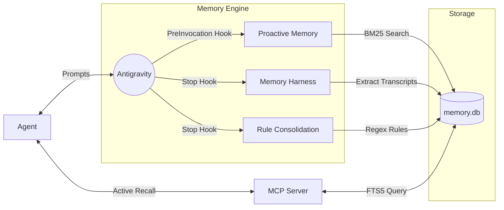

<div align="center">
  <h1>🧠 Antigravity Persistent Memory Plugin</h1>
  <p><em>A zero-configuration, native AI extension for <a href="https://github.com/google/antigravity">Google Antigravity</a></em></p>
</div>

> **Give your agent long-term, persistent memory across all your projects.**
> Instead of starting from scratch in every new conversation, your agent can now recall past solutions, bug fixes, custom configurations, and contextual history from any codebase you've previously worked on. Experience a true "human colleague" dynamic.

---

## 🏗️ System Architecture & Technical Deep Dive

The plugin utilizes a multi-layered architecture heavily relying on **SQLite's FTS5** (Full-Text Search), **Antigravity Customization hooks**, and **Model Context Protocol (MCP)** servers.



### 1. 🗄️ The Database (`memory.db`)
All memory is stored locally in an SQLite database (`memory.db`), initialized automatically by `harness.py`.
- **`conversations` table**: Tracks conversation UUIDs, associated workspaces, and last updated timestamps.
- **`messages` table**: Stores the raw transcript data (role, content, timestamp) linked to the conversation ID.
- **`messages_fts` (Virtual Table)**: An SQLite FTS5 virtual table providing ultra-fast BM25 ranking for full-text search. It uses database triggers (`AFTER INSERT`, `AFTER DELETE`, `AFTER UPDATE`) to keep the FTS index automatically synchronized.
- **`user_profile` table**: Stores consolidated, explicit rules extracted from conversations.

### 2. ⚡ Proactive Memory Injection (`scripts/proactive_memory.py`)
This script acts as the agent's **"subconscious memory"**.
- **Trigger**: Hooked into Antigravity's `PreInvocation` lifecycle event via `hooks.json`.
- **Mechanism**: Receives a JSON payload via `stdin` containing the `transcriptPath`. Parses the transcript backwards to find the exact last `USER_INPUT`.
- **Processing**: Cleans XML tags, removes common stopwords, and dynamically builds an `OR` query for the FTS5 engine.
- **Injection**: Executes a BM25 ranked search against `messages_fts`. Injects an ephemeral `<PROACTIVE_MEMORY>` block into the agent's context *before* generation begins.

### 3. 🔄 The Memory Harness (`scripts/harness.py`)
This script acts as the **ETL (Extract, Transform, Load)** pipeline for transcripts.
- **Trigger**: Hooked into Antigravity's `Stop` lifecycle event via `hooks.json` (runs in the background).
- **Mechanism**: Scans the `~/.gemini/antigravity-ide/brain/` directory for conversation UUIDs.
- **Processing**: Parses `transcript_full.jsonl` (fallback to `transcript.jsonl`). Uses regex heuristics to determine the workspace context. Filters for `USER_INPUT` and `PLANNER_RESPONSE` outputs, then bulk inserts them into `memory.db`, triggering the FTS5 sync.

### 4. 📜 Explicit Rule Consolidation (`scripts/consolidate.py`)
This script acts as the **"long-term behavioral memory"**.
- **Trigger**: Hooked into Antigravity's `Stop` lifecycle event.
- **Mechanism**: Queries all `USER` messages and runs regex patterns (e.g., `(?i)\b(?:always|never)\s+(?:do|use|make|write)\b.+`, `(?i)^rule:\s*.+`) to identify explicit instructions or preferences.
- **Storage**: Inserts these extracted rules into the `user_profile` table.

### 5. 🧠 Active Recall via MCP (`scripts/mcp_memory_server.py`)
This script acts as the **"conscious memory"** for the agent.
- **Implementation**: Built using the `FastMCP` framework, running over `stdio` transport.
- **Tools Exposed**:
  - `search_past_memory(query, limit)`: Executes BM25 FTS5 searches against `messages_fts`. Extracts exactly 1000 characters before and after the matched keyword to provide perfect surrounding context.
  - `get_user_profile()`: Retrieves consolidated rules from the `user_profile` table.
- **Agent Enforcement (`rules/GEMINI.md`)**: An Antigravity Customization rule (`trigger: model_decision`) explicitly instructs the model to use the MCP tools before starting complex tasks.

---

## 🚀 Installation

Install this plugin globally (for all projects) or locally (for a single workspace).

### 🌍 Global Installation *(Recommended)*
*Gives your agent memory access across every codebase on your machine.*

1. Clone or download this repository.
2. Move the `persistent-memory-plugin` folder into your global Antigravity config directory (create the `plugins/` directory if it does not exist):
   - **Windows:** `C:\Users\<YourUsername>\.gemini\config\plugins\`
   - **Mac/Linux:** `~/.gemini/config/plugins/`
3. Create a `plugins.json` file in that config directory (if it doesn't exist).
4. Open `plugins.json` and add the plugin:
   ```json
   {
     "plugins": [
       "persistent-memory"
     ]
   }
   ```

> [!NOTE]
> **`plugin.json` vs `plugins.json`**  
> This repository includes a singular `plugin.json` which acts as the manifest for this specific plugin. However, to turn it on, you must add it to your machine's global plural `plugins.json` configuration file, which acts as the master switchboard for all your installed plugins.

### 📁 Workspace Installation
*For team sharing or restricting memory to a specific project.*

1. Navigate to the root folder of your specific project.
2. Create the `.agents/plugins/` directory if it does not already exist.
3. Move or copy the `persistent-memory-plugin` folder into `YourProjectFolder/.agents/plugins/`.
4. Create a `plugins.json` file inside the `.agents/` folder (if it doesn't exist).
5. Open `plugins.json` and add the plugin:
   ```json
   {
     "plugins": [
       "persistent-memory"
     ]
   }
   ```

## 🗑️ Uninstallation
To remove the plugin, simply delete the `persistent-memory-plugin` directory and remove its entry from your `plugins.json`.

---

<div align="center">
  <p>Developed by <b>Shankarsan Sahoo</b>. Built with <a href="https://github.com/google/antigravity">Antigravity Customizations</a>.</p>
</div>
